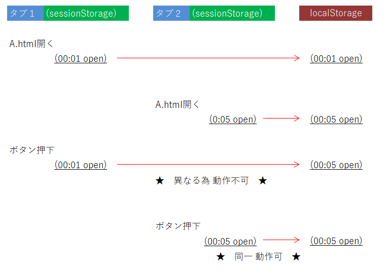

# Web Storage LT
## Fukuoka.php Vol.18
### ～PHP縛りなしのLT大会～

____
## 自己紹介


<br />
- twitter: @itoKami1123

- 福岡の中堅企業向け統合基幹業務システムをSaaSで提供している会社で働いてます。
子供たちが大きくなった時に福岡で仕事が困らない様に
福岡ITを盛り上げたいと思っています。

____
## いまさらですけど ..

____
## Web Storage 仕事でつかってますか？

____
## ちょっと調べてみました

____
## Web Storage API

- オリジン単位でデータを保存

```
プロトコル://ドメイン名:ぽーと番号 で判断
```

- キーと値のペアを保存できる

- 5MByteぐらい？  
  > モダンブラウザのストレージ容量まとめ  
  http://www.html5rocks.com/ja/tutorials/offline/quota-research/

_- - -_

## 2種類あるよ

- sessionStorage  
  ページのセッション中 (ブラウザを開いている間) に使用可能なデータ保存場所

- localStorage  
  ↑と同様。違いはブラウザを閉じても **持続**


_- - -_

## 値の登録

```JavaScript
var key = "key001";
var value = "data";
localStorage.setItem(key, value);

var data = {id:1, name:"ume"};
localStorage.setItem(key, JSON.stringify(data));
```
※ 注意 ※　文字列にして保存する

_- - -_

## 登録数を数える

```JavaScript
localStorage.setItem("key1", "umeboshi");
localStorage.setItem("key2", "takuwan");
localStorage.length; // => 2
```

_- - -_

## 保存番号から取得

```JavaScript
for (var i = 0, len=localStorage.length; i < len ; i++) {
  console.log("value=", localStorage.key(i));
}
```

> キーの順序はユーザエージェント依存であり、この順序に頼るべきではありません。
https://developer.mozilla.org/ja/docs/Web/API/Storage/key

_- - -_

## その他の一覧取得方法

```JavaScript
for (key in localStorage) {
    if (localStorage.hasOwnProperty(key)) {
        console.log("key=", key);
    }
}

// Object.keysだと hasOwnProperty いらないYO
Object.keys(localStorage).forEach(function(key) { console.log(key); });
```

> 直接のプロパティとして持っているかどうかを特定
obj.hasOwnProperty(prop)
https://developer.mozilla.org/ja/docs/Web/JavaScript/Reference/Global_Objects/Object/hasOwnProperty

_- - -_

## 値の取得

```JavaScript
var value = localStorage.getStorage(key);
// value文字列を元のJSON値に変換
var data = JSON.parse(value);
```

## 値の削除

```JavaScript
// 指定キーの削除
var key = "key-01";
localStorage.removeItem(key);

// まとめて全て削除
localStorage.clear();
```

_- - -_

## イベント

うまく動かない...調査中...

```JavaScript
window.addEventListener("storage", function(event) {
  console.log("storage event fire!", event);
});

```

_- - -_

### 資料

- Web Storage API  
  https://developer.mozilla.org/ja/docs/Web/API/Web_Storage_API

- 同一オリジンポリシー
  https://developer.mozilla.org/ja/docs/Web/Security/Same-origin_policy


____

## sessionStorage と localStorageの違いデモ

[demo](./sample/index.html)

____
## 複数タブを制御デモ



_- - -_

[demo](./sample/tab.html)

_- - -_

タブの複製されると判別できないΣ('o`
____

## まとめ

- ちょっとしたUIの制御に使えそう

- storage eventが動かせなかった...

- 大事なデータを長期間保持するのは怖い...

> : iOS 5.1 より Safari Mobile は localStorage データを cache フォルダに保存しており、概して空き容量が少ない場合に OS の要求により、時々クリーンアップを受けます。  
https://developer.mozilla.org/ja/docs/Web/API/Web_Storage_API

____
## おしまい
